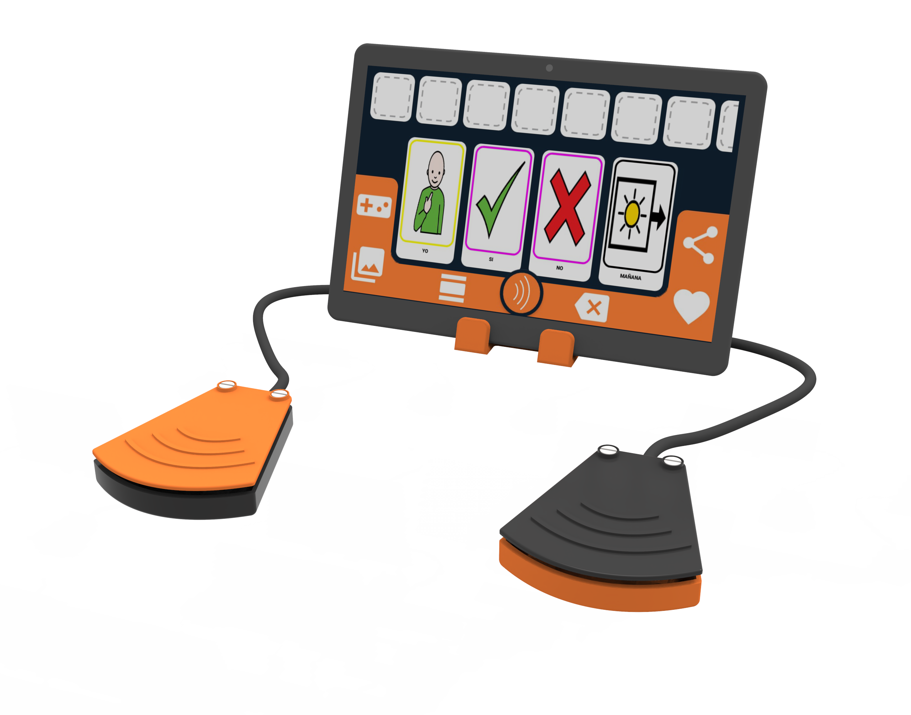

The Press & Press device imitates the functions of left and right clicking of a traditional PC mouse, which enables move on to the next element and select them with OTTAA Project's screen scan functionality. The device has been specifically designed for motor impaired people who have difficulties in their fine motor skills. It is compatible with Android, Windows, MacOS and Linux.

## Materials
* High quality sound cable (50cm).
* 4 limit switches.
* 4mm x 4 self tapping screw.
* Non-slip weatherstrip. D: 4mm, L: 230mm.
* PCB Genius DX110/120.
* OTG adapter.
* Glue and silicone.
* 3D printed push button (3 parts x 2). Link: [A](https://drive.google.com/file/d/1CficEc5HUZEojVipBvPkDPR9ZZAXRsz_/view?usp=sharing), [B](https://drive.google.com/file/d/17mDdYHb8EZ9sE3oHA-JYj-fRMQPmUcAi/view?usp=sharing), [C](https://drive.google.com/file/d/1tcJvlZxroxrnLInq5xDCOhOi1hKhlBDI/view?usp=sharing).
* 3D printed lectern (2 parts). Link: [D](https://drive.google.com/file/d/1z3RoKYi7vi-e8lv2JN_N4b7SeH1udlEW/view?usp=sharing), [E](https://drive.google.com/file/d/1EH0EHQhkieh16OotWjGcWZUpCBxzRASE/view?usp=sharing).

## Procedure
### 1. 3D Printing
    
Parts A, B, C, D and E  3D printing settings: 
 * Material: PLA.
 * Temperature of the hotend: 210-215 °C.
 * Temperature of the print bed: 50-60 °C.
 * Top and Bottom Layers: 3.
 * Perimeter Shells: 3.
 * Infill: 25%.
 * Support: 75°(only D.stl).

 ### 2. Dismantle Genius DX 120 Mouse
 Take out the mouse PCB and remove the left and right click limit switches.

 ### 3. Assemble the push-buttons
 Assemble the push-buttons
Glue the top (B) and the skirt (C) together (BC)
Place the two limit switches on the base of the 3D printed push button (A).
Using bipolar cables connect them in a parallel connection and weld them to the PCB. The push buttons have to work in normally opened mode. ([Figure 7](https://drive.google.com/file/d/1hJX_H08zH5Y6z50uw2MZ4vjAfXDva6Sh/view?usp=sharing), [Figure 8](https://drive.google.com/file/d/1mCdPttvOAZV-D-qX5y5ws7LYHEmS7hX4/view?usp=sharing), [PCB connection](https://drive.google.com/file/d/1APXE_7N2-TtJhBHzjSdUjh6Z4agkxLwp/view?usp=sharing)). 
Place BC on A and fix it with two self-tapping screws ([Figure 9](https://drive.google.com/file/d/1IaYppWFhCYig1H7bOUKBdTVWCPXoFMCv/view?usp=sharing)).
Repeat the same steps for the second button.

### 4. Assemble the tablet stand
Place the PCB on the base of the tablet stand (D), ensuring the correct positioning of the bipolar cables.
Fit the base of the lectern with the tablet stand housing (E) by pressing and fixing it with a self-tapping screw to close the tablet stand.

## Blueprints
The technical drawings of the parts to be printed are shown below:
* [A](https://drive.google.com/file/d/1WjWpWcg1P_cGGSEbP0U1ywfZkeA2ngWo/view?usp=sharing)
* [B](https://drive.google.com/file/d/1NYNzlGXLMBZUwcXMm_nin6Wj314eVYtC/view?usp=sharing)
* [C](https://drive.google.com/file/d/1AZrRnG13Za0zcgXFpBS45YTMuNVuiynv/view?usp=sharing)
* [D](https://drive.google.com/file/d/1_jd9kli9ysh8BuX5micqTNPQX_uEPNjB/view?usp=sharing)
* [E](https://drive.google.com/file/d/1LgwKxKWrxWNAA_plA4ngFvSCZesAGAog/view?usp=sharing)
